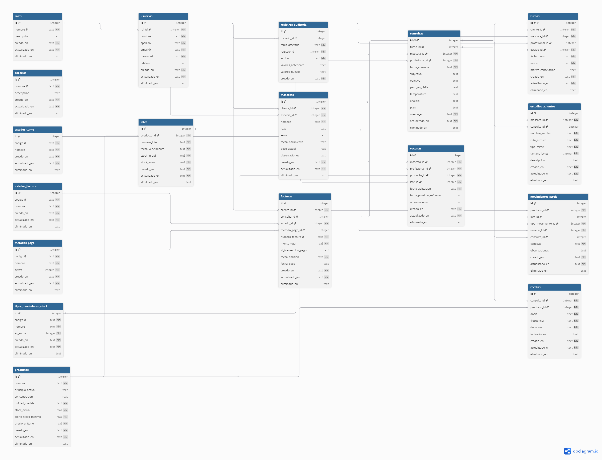

# Arquitectura y Tecnologias del Backend

Este documento describe en detalle el diseno arquitectonico, los principios de desarrollo, la separacion de responsabilidades, el modelo de datos y el stack tecnologico implementado en el backend del Sistema Integral de Gestion Veterinaria.

---

## 1. Stack Tecnologico

El backend esta construido sobre el ecosistema Node.js, seleccionando herramientas que aseguran rendimiento, mantenibilidad y tipado relacional:

- **Entorno de ejecucion:** Node.js
- **Framework web:** Express
  - Provee la infraestructura base para el enrutamiento HTTP, manejo de middlewares y configuracion de la API REST.
- **ORM / Persistencia:** Sequelize
  - Administra el mapeo objeto-relacional (ORM), migraciones de esquemas, relaciones entre entidades y hooks del ciclo de vida de los datos.
- **Base de Datos:** SQLite3
  - Motor relacional embebido, ideal para el desarrollo agil del MVP y facilmente migrable a PostgreSQL / MySQL en entornos de mayor concurrencia.
- **Seguridad y Criptografia:**
  - `jsonwebtoken` (JWT): Manejo de sesiones stateless mediante tokens de autorizacion en formato `Bearer`.
  - `bcryptjs`: Hasheo unidireccional con salt de contrasenas de usuarios.
- **Validacion de Entrada:** Joi
  - Validacion estricta y declarativa de cargas utiles (`payloads`) en solicitudes HTTP antes de alcanzar la logica de negocio.
- **Configuracion y Utilidades:**
  - `dotenv`: Administracion de variables de entorno desacopladas del codigo fuente.
  - `cors`: Gestion de politicas de intercambio de recursos de origen cruzado para permitir el consumo seguro desde el frontend.

---

## 2. Patron Arquitectonico: Arquitectura en Capas (Layered Architecture)

El backend implementa una **Arquitectura en Capas (N-Tier Architecture)** guiada por los principios **SOLID** (principalmente *Single Responsibility* y *Separation of Concerns*).

Bajo este esquema, se adopta el patron de **Controladores Delgados (Thin Controllers)** y **Servicios Ricos (Fat Services)**: los controladores se limitan a la recepcion y respuesta HTTP, mientras que toda la logica de dominio, validacion de permisos y orquestacion reside exclusivamente en la capa de servicios.

### Diagrama de Flujo de una Peticion

```text
                  Cliente HTTP (Frontend / Postman)
                                │
                                ▼ [HTTP Request + Header Authorization]
┌─────────────────────────────────────────────────────────────────────────────┐
│ 1. CAPA DE ENRUTAMIENTO (Routers)                                           │
│    - Define endpoints y asocia metodos (GET, POST, PUT, DELETE)             │
└──────────────────────────────────────┬──────────────────────────────────────┘
                                       │
                                       ▼
┌─────────────────────────────────────────────────────────────────────────────┐
│ 2. CAPA DE MIDDLEWARES                                                      │
│    - Autenticacion: Verifica firma JWT y extrae req.user                     │
│    - Autorizacion: Valida permisos y roles requeridos (requireRole)         │
│    - Validacion de Datos: Valida req.body con esquemas Joi                  │
└──────────────────────────────────────┬──────────────────────────────────────┘
                                       │
                                       ▼
┌─────────────────────────────────────────────────────────────────────────────┐
│ 3. CAPA DE CONTROLADORES (Controllers)                                      │
│    - Extrae parametros (req.body, req.params, req.user)                     │
│    - Delega la ejecucion al servicio correspondiente                        │
│    - Retorna codigo de estado HTTP y JSON resultante                        │
└──────────────────────────────────────┬──────────────────────────────────────┘
                                       │
                                       ▼
┌─────────────────────────────────────────────────────────────────────────────┐
│ 4. CAPA DE SERVICIOS (Services - Logica de Negocio)                         │
│    - Aplica reglas de negocio y restricciones de dominio                    │
│    - Valida pertenencia de registros segun el rol del usuario autenticado   │
│    - Dispara errores semanticos (NotFoundError, ForbiddenError, etc.)       │
└──────────────────────────────────────┬──────────────────────────────────────┘
                                       │
                                       ▼
┌─────────────────────────────────────────────────────────────────────────────┐
│ 5. CAPA DE ACCESO A DATOS (Models / ORM Sequelize)                          │
│    - Ejecuta consultas relacionales (findAll, findByPk, create, update)     │
│    - Inyecta hooks (hasheo automatico con bcrypt) y relaciones (1:N)        │
│    - Sanitiza salida mediante toJSON (omision de campos sensibles)          │
└──────────────────────────────────────┬──────────────────────────────────────┘
                                       │
                                       ▼
┌─────────────────────────────────────────────────────────────────────────────┐
│ BASE DE DATOS RELACIONAL (SQLite3)                                          │
└─────────────────────────────────────────────────────────────────────────────┘
```

---

## 3. Desglose y Responsabilidad de las Capas

### 3.1. Capa de Enrutamiento (`src/db/routers/`)
- Mapea las URLs publicas y privadas de la API (`/api/auth`, `/api/usuarios`, `/api/mascotas`, `/api/turnos`).
- Actua como primer punto de entrada ensamblando los middlewares necesarios antes de invocar al controlador.

### 3.2. Capa de Middlewares (`src/db/middlewares/`)
- **`auth.middleware.js`:**
  - `authenticateToken`: Extrae y valida el token Bearer del header `Authorization`. Si el token es valido, inyecta la informacion del usuario (`id`, `email`, `rol`) en `req.user`.
  - `requireRole`: Restringe el acceso a endpoints especificos segun los roles permitidos (ej. solo `profesional`).
- **`schemaValidator.js`:**
  - Ejecuta validaciones sincronas del cuerpo de la peticion utilizando esquemas Joi (`schema/`). Si la peticion es invalida, interrumpe el ciclo y responde con error `400 Bad Request` detallando el campo con error.
- **`error.middleware.js`:**
  - Interceptor global de errores ubicado al final de la cadena de Express. Captura cualquier excepcion arrojada en capas inferiores y devuelve una respuesta estructurada en formato JSON (`{ error: string, statusCode: number }`).

### 3.3. Capa de Controladores (`src/db/controllers/`)
- No ejecutan consultas a la base de datos ni contienen logica condicional de negocio.

### 3.4. Capa de Servicios (`src/db/services/`)
- Es el nucleo de la aplicacion. Desacoplada del protocolo HTTP, es facilmente testeable y reutilizable.
- Controla las reglas de acceso por rol a nivel de registro:
  - **Clientes:** Solo pueden listar, consultar, crear y modificar registros propios (sus mascotas y sus turnos).
  - **Profesionales:** Tienen visibilidad global de los turnos de todos los clientes, con inclusion relacional de los datos del paciente y del tutor.

### 3.5. Capa de Modelos y Datos (`src/db/models/`)
- Define los modelos de datos de Sequelize (`Usuario`, `Mascota`, `Turno`) con sus restricciones de columna, tipos y valores por defecto.
- **Hooks de Modelo:**
  - En `Usuario`: Hashea automaticamente contrasenas nuevas o modificadas mediante `bcryptjs` en los hooks `beforeCreate` y `beforeUpdate`.
- **Sanitizacion de Seguridad:**
  - Se sobreescribe el metodo `toJSON()` en el modelo `Usuario` para asegurar que el hash de la contrasena nunca viaje en las respuestas de la API.

### 3.6. Utilidades y Errores Semanticos (`src/db/utils/customErrors.js`)
- Estandarizacion de excepciones mediante clases heredadas de `Error`:
  - `NotFoundError` (404)
  - `UnauthorizedError` (401)
  - `ForbiddenError` (403)
  - `ConflictError` (409)
  - `BadRequestError` (400)

---

## 4. Estructura de Directorios

```text
proyecto-integrador-veterinaria-backend/
├── data/                               # Almacenamiento local de base de datos SQLite
├── docs/                               # Documentacion del sistema
│   ├── ARQUITECTURA.md                 # Especificacion tecnica de arquitectura (este archivo)
│   ├── CONVENCION-RAMAS.md             # Estandares de ramas y commits de Git
│   ├── DER.dbml                        # Esquema completo en formato DBML (dbdiagram.io)
│   ├── DER-PF-VETERINARIA.png          # Diagrama Entidad-Relacion (Render visual)
│   └── MVP1.md                         # Alcance funcional del MVP
├── src/
│   ├── main.js                         # Inicializacion del servidor Express y sync de BD
│   └── db/
│       ├── config/
│       │   └── config.json             # Configuracion de conexiones Sequelize
│       ├── controllers/                # Controladores HTTP
│       ├── middlewares/                # Middlewares (Auth, Validacion, Errores)
│       ├── models/                     # Modelos relacionales de Sequelize
│       ├── routers/                    # Enrutadores REST
│       ├── schema/                     # Esquemas de validacion Joi
│       ├── services/                   # Capa de logica de negocio
│       └── utils/                      # Errores personalizados
├── .env.example                        # Ejemplo de variables de entorno
└── package.json                        # Manifiesto de dependencias y scripts
```

---

## 5. Modelo de Dominio y Relaciones

A continuacion se presenta el Diagrama Entidad-Relacion (DER) del sistema:



El esquema completo en formato DBML (3FN) se encuentra disponible y versionado en [docs/DER.dbml](./DER.dbml), el cual puede ser importado y editado interactivamente en [dbdiagram.io](https://dbdiagram.io/).

El modelo de datos relacional implementado en Sequelize contempla las siguientes relaciones principales:

```text
┌─────────────────┐       1:N       ┌─────────────────┐
│     Usuario     │ ─────────────── │     Mascota     │
│  (Cliente/Prof) │                 │  (Paciente)     │
└─────────────────┘                 └─────────────────┘
        │ 1                                  │ 1
        │                                    │
        │ N                                  │ N
        ▼                                    ▼
┌─────────────────────────────────────────────────────┐
│                        Turno                        │
│         (Fecha, Motivo, Estado, usuarioId,          │
│                     mascotaId)                      │
└─────────────────────────────────────────────────────┘
```

### Definicion de Asociaciones
- `Usuario.hasMany(Mascota, { foreignKey: 'usuarioId', as: 'mascotas' })`
- `Mascota.belongsTo(Usuario, { foreignKey: 'usuarioId', as: 'dueno' })`
- `Usuario.hasMany(Turno, { foreignKey: 'usuarioId', as: 'turnos' })`
- `Turno.belongsTo(Usuario, { foreignKey: 'usuarioId', as: 'usuario' })`
- `Mascota.hasMany(Turno, { foreignKey: 'mascotaId', as: 'turnos' })`
- `Turno.belongsTo(Mascota, { foreignKey: 'mascotaId', as: 'mascota' })`

---

## 6. Control de Acceso Basado en Roles (RBAC)

El sistema maneja dos roles principales a nivel de modelo y autorizacion:

| Rol | Alcance y Capacidades en la API |
| :--- | :--- |
| **`cliente`** | - Registro y autenticacion.<br>- Gestion completa (alta, baja, edicion, consulta) de sus propias mascotas.<br>- Solicitud de turnos asociando una de sus mascotas.<br>- Visualizacion y cancelacion de sus turnos. |
| **`profesional`** | - Acceso administrativo a la bandeja general de turnos.<br>- Consulta de turnos con inclusion automatica (`eager loading`) de datos del paciente y datos de contacto del tutor (`nombre`, `apellido`, `email`, `telefono`).<br>- Actualizacion del estado de atencion de cualquier turno (`pendiente`, `confirmado`, `cancelado`, `completado`).<br>- Acceso a la ficha clinica de cualquier mascota registrada. |

---

## 7. Gestion de Errores y Formato de Respuesta

Cuando ocurre una excepcion durante el procesamiento de una solicitud, el middleware global responde uniformemente:

```json
{
  "error": "Mensaje descriptivo del error",
  "statusCode": 404
}
```

Esto permite al frontend manejar estados de error de forma desacoplada y predecible a traves de interceptores o bloques `try/catch`.
